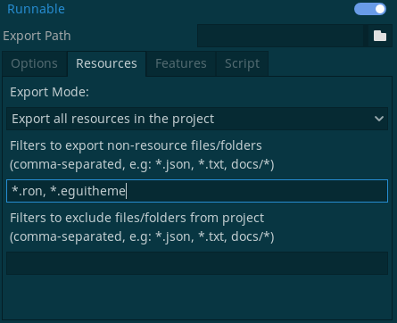

# Egui Stylist Addons

These are officially maintained godot integrations for `egui-stylist`.

At this time, it is assumed that you are familiar with godot-rust in order to use this application as you will need to build the binaries using `cargo`

In addition, to prevent editor crashes, it is a requirement that these plugins be built separately from your main game repository.
## Installation

1. Copy the "addons" directory into your godot project's "res://addons"
2. Build the needed libraries with `cargo build --lib --release`
3. Copy the resulting binaries to the following paths based on your target OS, you you wish to run the binaries out of a separate directly, you may modify the paths in the "egui_stylist_lib.gdnlib" file
    Linux: "res://addons/egui_stylist/libgodot_egui_stylist.so"
    MacOS: "res://addons/egui_stylist/libgodot_egui_stylist.dylib"
    Windows: "res://addons/egui_stylist/godot_egui_stylist.dll"
4. Enable the addons in the Godot Project Settings
Use the `cargo build --lib --release` command from the the `egui_stylist_addon` directory. Then copy the resulting binaries into `res://addons/egui_stylist/` directory in your project.

## Egui Stylist Addon

This addon wraps the egui-stylist native application for convenient use from the Godot editor

Activate this addon in the plugins menu.

### Creating your first theme

To create your first theme, activate "egui-stylist" and either load one of the existing `.eguitheme` files or start editing the settings from scratch.

Once you have a theme that you are satisfied with, click "File > Save" and save the file to a convenient location. This will serialize the file into a `.eguitheme` that will be importable by using the eguitheme importer addon in separate projects.

To use this theme, just add the filepath to the theme property in the `GodotEgui` Control and it will load during `_ready()`.

**Note**: To ensure that the `.eguitheme` or `.ron` file is exported properly, it is very important to ensure that the the resources are properly exported.

## Stability

This addon is based on [egui-stylist](https://github.com/jacobsky/egui-stylist) and this addon is still considered to be unstable for the time being.

## UX Concerns or bugs

If you have any ideas for UX improvements, please create an issue in the [egui-stylist](https://github.com/jacobsky/egui-stylist/issues) repository as that is the library that serves as the basis. Please include a description of the issue that you are facing.